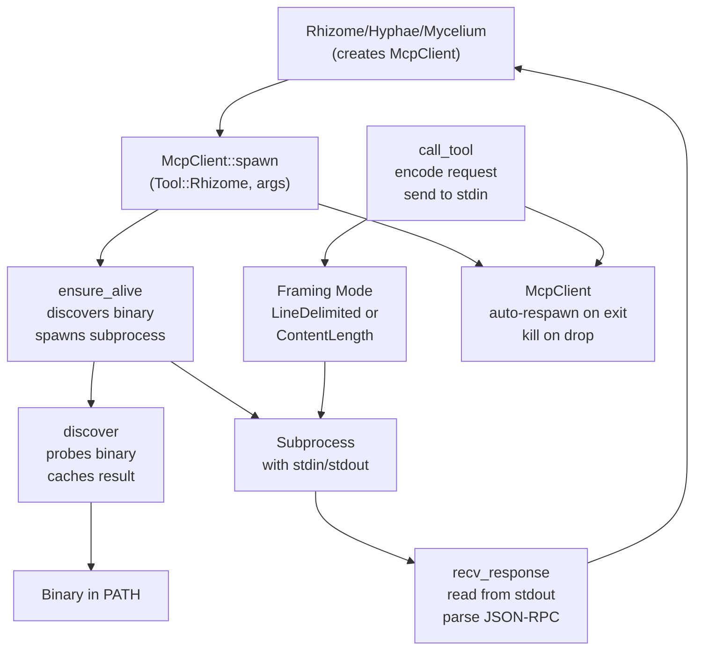

# Spore Internals

Shared Rust library for the claude-mycelium ecosystem. Provides tool discovery, JSON-RPC 2.0 primitives, and subprocess MCP communication used by Mycelium, Hyphae, and Rhizome.

Named after fungal spores — lightweight carriers of information between separate organisms.

## Module Overview

```
spore/src/
├── lib.rs           # Re-exports (public API)
├── discovery.rs     # Tool discovery in PATH with caching
├── jsonrpc.rs       # JSON-RPC 2.0 request/response types + framing
├── subprocess.rs    # McpClient: spawn tool subprocess + communicate
└── types.rs         # Tool enum, ToolInfo, EcosystemStatus, ProjectContext
```

## Discovery Module

`src/discovery.rs`: find ecosystem tools in PATH with lifetime caching.

### Architecture

```rust
static CACHE: OnceLock<HashMap<Tool, Option<ToolInfo>>> = OnceLock::new();

pub fn discover(tool: Tool) -> Option<ToolInfo> {
    let cache = CACHE.get_or_init(|| {
        let mut map = HashMap::new();
        for &t in Tool::all() {
            map.insert(t, probe(t));
        }
        map
    });
    cache.get(&tool).and_then(Clone::clone)
}

pub fn discover_all() -> Vec<ToolInfo> {
    Tool::all().iter().filter_map(|&t| discover(t)).collect()
}
```

**Key design:**
- Initialized once per process lifetime
- `OnceLock` provides thread-safe lazy initialization
- `Option<ToolInfo>` indicates success/not-found

### Probing

```rust
fn probe(tool: Tool) -> Option<ToolInfo> {
    let binary_path = which::which(tool.binary_name()).ok()?;

    let output = std::process::Command::new(&binary_path)
        .arg("--version")
        .output()
        .ok()?;

    let stdout = String::from_utf8_lossy(&output.stdout);
    let version = parse_version(&stdout).unwrap_or_default();

    Some(ToolInfo {
        tool,
        binary_path,
        version,
    })
}

fn parse_version(output: &str) -> Option<String> {
    let first_line = output.lines().next()?;
    let version_part = first_line.split_whitespace().last()?;
    if version_part.contains('.') {
        Some(version_part.to_string())
    } else {
        Some(first_line.trim().to_string())
    }
}
```

**Version parsing:**
- Expects format: `tool_name X.Y.Z` or just `X.Y.Z`
- Extracts last space-separated token if it contains `.`
- Falls back to entire first line if no version found

### Result

```rust
pub struct ToolInfo {
    pub tool: Tool,
    pub binary_path: PathBuf,
    pub version: String,
}
```

Each ecosystem tool should support `--version` output for discovery.

## JSON-RPC Module

`src/jsonrpc.rs`: JSON-RPC 2.0 request/response types with two framing modes.

### Request Type

```rust
#[derive(Debug, Clone, Serialize, Deserialize)]
pub struct Request {
    pub jsonrpc: String,  // always "2.0"
    pub id: i64,          // auto-incrementing from static NEXT_ID
    pub method: String,   // e.g., "tools/call"
    #[serde(default)]
    pub params: Value,    // serde_json::Value for flexibility
}

impl Request {
    pub fn new(method: &str, params: Value) -> Self {
        Self {
            jsonrpc: "2.0".to_string(),
            id: NEXT_ID.fetch_add(1, Ordering::Relaxed),
            method: method.to_string(),
            params,
        }
    }
}
```

**Auto-incrementing IDs:**
```rust
static NEXT_ID: AtomicI64 = AtomicI64::new(1);
```
Thread-safe without locks. Each call auto-increments globally.

### Response Type

```rust
#[derive(Debug, Clone, Serialize, Deserialize)]
pub struct Response {
    pub jsonrpc: String,
    pub id: i64,
    #[serde(skip_serializing_if = "Option::is_none")]
    pub result: Option<Value>,
    #[serde(skip_serializing_if = "Option::is_none")]
    pub error: Option<RpcError>,
}

#[derive(Debug, Clone, Serialize, Deserialize)]
pub struct RpcError {
    pub code: i64,              // JSON-RPC error code (-32700 to -32600, etc.)
    pub message: String,        // human-readable error
    #[serde(skip_serializing_if = "Option::is_none")]
    pub data: Option<Value>,    // additional error context
}
```

Only one of `result` or `error` is populated. Both are skipped from JSON if `None`.

### Framing Modes

**Content-Length framing** (LSP style, MCP standard):

```rust
pub fn encode(request: &Request) -> String {
    let json = serde_json::to_string(request).expect("Cannot fail");
    format!("Content-Length: {}\r\n\r\n{json}", json.len())
}
```

Output:
```
Content-Length: 123\r\n\r\n{"jsonrpc":"2.0","id":1,"method":"tools/call",...}
```

**Decoding:**

```rust
pub fn decode(input: &str) -> Result<Response> {
    let body = if let Some(idx) = input.find("\r\n\r\n") {
        &input[idx + 4..]
    } else if let Some(idx) = input.find("\n\n") {
        &input[idx + 2..]
    } else {
        input  // bare JSON, no headers
    };
    serde_json::from_str(body).context("Failed to parse JSON-RPC response")
}
```

Handles both standard `\r\n\r\n` and common `\n\n` separators. Falls back to bare JSON if no header found (compatible with both LSP and line-delimited framing).

## Subprocess Module

`src/subprocess.rs`: MCP client for spawning and communicating with tool subprocesses.

### Framing Enum

```rust
#[derive(Debug, Clone, Copy, Default)]
pub enum Framing {
    #[default]
    LineDelimited,    // Newline-delimited JSON (ecosystem MCP servers)
    ContentLength,    // LSP-style Content-Length headers (LSP servers)
}
```

Default is `LineDelimited` for ecosystem tools (Hyphae, Rhizome). Can be switched to `ContentLength` for LSP servers.

### McpClient

```rust
pub struct McpClient {
    tool: Tool,
    args: Vec<String>,
    child: Option<Child>,
    timeout: Duration,
    framing: Framing,
}

impl McpClient {
    pub fn spawn(tool: Tool, args: &[&str]) -> Result<Self> {
        let mut client = Self {
            tool, args: args.iter().map(|&s| s.to_string()).collect(),
            child: None, timeout: DEFAULT_TIMEOUT, framing: Framing::default(),
        };
        client.ensure_alive()?;
        Ok(client)
    }

    pub fn with_timeout(mut self, timeout: Duration) -> Self {
        self.timeout = timeout;
        self
    }

    pub fn with_framing(mut self, framing: Framing) -> Self {
        self.framing = framing;
        self
    }
}
```

**Builder pattern** for configuration:
```rust
let client = McpClient::spawn(Tool::Rhizome, &["serve", "--project", "."])?
    .with_timeout(Duration::from_secs(30))
    .with_framing(Framing::ContentLength);
```

### Tool Call Flow

```rust
pub fn call_tool(&mut self, name: &str, arguments: Value) -> Result<Value> {
    self.ensure_alive()?;

    let request = jsonrpc::Request::new(
        "tools/call",
        json!({ "name": name, "arguments": arguments }),
    );

    let encoded = jsonrpc::encode(&request);
    self.send_request(&encoded)?;
    let response = self.recv_response()?;

    if let Some(error) = response.error {
        bail!("RPC error {}: {}", error.code, error.message);
    }

    response.result.context("Empty result in response")
}
```

**Lifecycle:**
1. Ensure subprocess is alive (spawn if needed)
2. Construct JSON-RPC request with auto-incremented ID
3. Encode using configured framing mode
4. Send to subprocess stdin (with flush)
5. Read response (blocking) using configured framing
6. Check for RPC error, extract result value
7. Return to caller

### Request Sending

```rust
fn send_request(&mut self, encoded: &str) -> Result<()> {
    let child = self.child.as_mut().context("No child process")?;
    let stdin = child.stdin.as_mut().context("No stdin")?;

    match self.framing {
        Framing::LineDelimited => {
            stdin.write_all(encoded.as_bytes())?;
            stdin.write_all(b"\n")?;
        }
        Framing::ContentLength => {
            let header = format!("Content-Length: {}\r\n\r\n", encoded.len());
            stdin.write_all(header.as_bytes())?;
            stdin.write_all(encoded.as_bytes())?;
        }
    }

    stdin.flush()?;
    Ok(())
}
```

**LineDelimited:** plain JSON + single newline.
**ContentLength:** Content-Length header, blank line, then JSON (no newline after JSON).

### Response Reading

```rust
fn recv_response(&mut self) -> Result<jsonrpc::Response> {
    let child = self.child.as_mut().context("No child process")?;
    let stdout = child.stdout.as_mut().context("No stdout")?;
    let mut reader = BufReader::new(stdout);

    match self.framing {
        Framing::LineDelimited => read_line_delimited(&mut reader),
        Framing::ContentLength => read_content_length(&mut reader),
    }
}

fn read_line_delimited(reader: &mut BufReader<&mut ChildStdout>) -> Result<jsonrpc::Response> {
    let mut line = String::new();
    let n = reader.read_line(&mut line)?;
    if n == 0 { bail!("EOF while reading response"); }
    serde_json::from_str(line.trim()).context("Failed to parse line-delimited response")
}

fn read_content_length(reader: &mut BufReader<&mut ChildStdout>) -> Result<jsonrpc::Response> {
    let mut content_length = 0;

    // Read headers until blank line
    loop {
        let mut line = String::new();
        reader.read_line(&mut line)?;
        let trimmed = line.trim();
        if trimmed.is_empty() { break; }
        if let Some(len) = trimmed.strip_prefix("Content-Length: ") {
            content_length = len.parse().context("Invalid Content-Length")?;
        }
    }

    if content_length == 0 { bail!("No Content-Length in response"); }

    // Read body
    let mut body = vec![0u8; content_length];
    std::io::Read::read_exact(reader, &mut body)?;
    let body_str = String::from_utf8(body)?;

    serde_json::from_str(&body_str).context("Failed to parse response body")
}
```

**LineDelimited:** read one line, parse as JSON.
**ContentLength:** read headers until blank line, extract Content-Length, read exact byte count, parse JSON.

### Subprocess Lifecycle

```rust
pub fn is_alive(&mut self) -> bool {
    self.child
        .as_mut()
        .is_some_and(|c| c.try_wait().ok().flatten().is_none())
}

fn ensure_alive(&mut self) -> Result<()> {
    if self.is_alive() { return Ok(()); }

    // Kill old process if it exists
    if let Some(mut child) = self.child.take() {
        let _ = child.kill();
    }

    // Discover tool (or use cached path)
    let info = discover(self.tool)
        .with_context(|| format!("{} not found in PATH", self.tool))?;

    // Spawn new process
    let child = Command::new(&info.binary_path)
        .args(&self.args)
        .stdin(Stdio::piped())
        .stdout(Stdio::piped())
        .stderr(Stdio::null())
        .spawn()
        .with_context(|| format!("Failed to spawn {}", self.tool))?;

    self.child = Some(child);
    Ok(())
}

impl Drop for McpClient {
    fn drop(&mut self) {
        if let Some(mut child) = self.child.take() {
            let _ = child.kill();
        }
    }
}
```

**Key features:**
- Auto-respawn if process exits (checked on next call)
- Silent kill on old process (don't error if already dead)
- Defer discovery until first use (binary may not exist initially)
- Graceful cleanup on drop

## Types Module

`src/types.rs`: Tool enum, ToolInfo, EcosystemStatus, ProjectContext.

### Tool Enum

```rust
#[derive(Debug, Clone, Copy, PartialEq, Eq, Hash, Serialize, Deserialize)]
#[serde(rename_all = "lowercase")]
pub enum Tool {
    Mycelium,
    Hyphae,
    Rhizome,
    Cap,  // Web dashboard (Node.js)
}

impl Tool {
    pub fn binary_name(self) -> &'static str {
        match self {
            Self::Mycelium => "mycelium",
            Self::Hyphae => "hyphae",
            Self::Rhizome => "rhizome",
            Self::Cap => "cap",
        }
    }

    pub fn all() -> &'static [Tool] {
        &[Self::Mycelium, Self::Hyphae, Self::Rhizome, Self::Cap]
    }

    pub fn min_spore_version(self) -> &'static str {
        match self {
            _ => "0.1.0",  // All tools compatible with spore 0.1.0+
        }
    }
}
```

Serializes as lowercase for JSON/config files. Cap is included but may not be in PATH (web dashboard is npm-based).

### ToolInfo

```rust
#[derive(Debug, Clone, Serialize, Deserialize)]
pub struct ToolInfo {
    pub tool: Tool,
    pub binary_path: PathBuf,
    pub version: String,
}
```

Returned by `discover()`. Contains everything needed to spawn the tool.

### EcosystemStatus

```rust
#[derive(Debug, Clone, Serialize, Deserialize)]
pub struct EcosystemStatus {
    pub tools: Vec<ToolInfo>,
    pub timestamp: chrono::DateTime<chrono::Utc>,
}
```

Snapshot of all discovered tools with timestamp.

### ProjectContext

```rust
#[derive(Debug, Clone, Serialize, Deserialize)]
pub struct ProjectContext {
    pub name: String,
    pub root: PathBuf,
    pub detected_languages: Vec<String>,
}

impl ProjectContext {
    pub fn detect(path: &Path) -> Self {
        let root = find_git_root(path).unwrap_or_else(|| path.to_path_buf());
        let name = root.file_name()
            .map_or_else(|| "unknown".to_owned(), |n| n.to_string_lossy().into_owned());
        let detected_languages = detect_languages(&root);

        Self { name, root, detected_languages }
    }
}
```

**Detection logic:**

```
find_git_root(path)
├─ Walk up from path looking for .git directory
└─ Return first match, or None if reached filesystem root

detect_languages(root)
├─ Scan top 2 directory levels
├─ Count files by extension (rs, py, ts, js, go, etc.)
└─ Return top 3 languages by count
```

Maps extensions to languages:

| Extension | Language |
|-----------|----------|
| rs | rust |
| py | python |
| ts, tsx | typescript |
| js, jsx | javascript |
| go | go |
| java | java |
| c, h | c |
| cpp, cc, hpp | cpp |
| rb | ruby |

## Integration Diagram



## Usage Example

```rust
use spore::discovery::discover;
use spore::subprocess::{McpClient, Framing};
use spore::types::Tool;
use serde_json::json;
use std::time::Duration;

// Discover a tool
let info = discover(Tool::Rhizome).expect("Rhizome not found");
println!("Found {} at {}", info.tool, info.binary_path.display());

// Create client for the tool
let mut client = McpClient::spawn(Tool::Rhizome, &["serve", "--project", "."])
    .expect("Failed to spawn Rhizome");

// Call a tool
let result = client
    .call_tool("get_symbols", json!({ "file": "main.rs" }))
    .expect("Tool call failed");

println!("Symbols: {}", result);

// Auto-respawn if process exits
let result2 = client
    .call_tool("get_structure", json!({ "file": "lib.rs" }))
    .expect("Tool call failed (would respawn if needed)");
```

## Testing

### Unit Tests

**discovery.rs:**
- Version parsing with/without tool name
- OnceLock initialization
- Caching behavior

**jsonrpc.rs:**
- Encode/decode roundtrip
- Content-Length handling
- Error responses with/without data
- Bare JSON fallback

**subprocess.rs:**
- Stub client without subprocess
- Mock Python subprocess (line-delimited and content-length)
- Process lifecycle (is_alive, ensure_alive, drop)
- Tool call roundtrip
- Respawn after exit

**types.rs:**
- Git root detection
- Language detection from extensions
- ProjectContext::detect
- Extension to language mapping

### Mock Subprocess

Tests use Python mock servers to verify framing without requiring actual ecosystem tools:

```python
# Line-delimited mock
line = sys.stdin.readline()
resp = '{"jsonrpc":"2.0","id":1,"result":{"content":[...]}}'
sys.stdout.write(resp + '\n')
sys.stdout.flush()
```

```python
# Content-Length mock
while True:
    ch = sys.stdin.read(1)
    if not ch or ch == '}': break
resp = '{"jsonrpc":"2.0","id":1,"result":{"content":[...]}}'
sys.stdout.write(f'Content-Length: {len(resp)}\r\n\r\n{resp}')
sys.stdout.flush()
```

## Key Design Principles

1. **No dependencies on ecosystem tools**: Spore is pure library, no Hyphae/Rhizome required
2. **Pluggable framing**: supports both line-delimited and Content-Length modes
3. **Auto-respawn**: process failure is not fatal, next call respawns
4. **Graceful degradation**: if tool not found, error on first use (not on client creation)
5. **Thread-safe IDs**: atomic counter for JSON-RPC IDs
6. **One-time discovery**: cache tool paths for process lifetime
7. **Clean shutdown**: Drop impl kills subprocess
8. **No async/await**: pure sync for ease of integration

## Consumed By

- **Mycelium**: discovers Hyphae/Rhizome via `spore::discovery`
- **Hyphae**: uses `ProjectContext::detect` for workspace detection
- **Rhizome**: discovers Hyphae for memoir export via `McpClient`
- **Cap**: subprocess pool via `RhizomeClient` (own implementation, mirrors spore)

All consumers use git dependency: `spore = { git = "...", tag = "vX.Y.Z" }`
